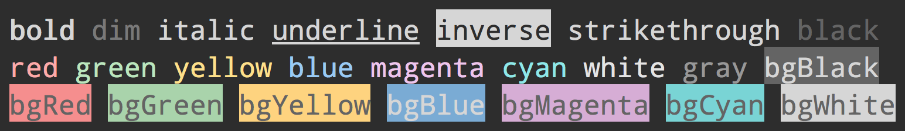

# ansi-styles

> [ANSI escape codes](http://en.wikipedia.org/wiki/ANSI_escape_code#Colors_and_Styles) for styling strings in the terminal



## Install

```
$ composer require cdoco/ansi-styles
```

## Usage

```php
require_once 'vendor/autoload.php';

$style = new \Cdoco\AnsiStyles();

echo $style->blue->open . 'Hello Word!' . PHP_EOL . $style->blue->close;

echo $style->color->rgb(100, 200, 15) . "Hello Word!" . PHP_EOL . $style->color->close;
echo $style->color->hsl(120, 100, 60) . "Hello Word!" . PHP_EOL . $style->color->close;
echo $style->color->hex('#C0FFEE') . "Hello Word!" . PHP_EOL . $style->color->close;

echo $style->bgColor->rgb(100, 200, 15) . "Hello Word!" . PHP_EOL . $style->bgColor->close;
```

## API

Each style has an `open` and `close` property.

## Styles

### Modifiers

- `reset`
- `bold`
- `dim`
- `italic` *(Not widely supported)*
- `underline`
- `inverse`
- `hidden`
- `strikethrough` *(Not widely supported)*

### Colors

- `black`
- `red`
- `green`
- `yellow`
- `blue`
- `magenta`
- `cyan`
- `white`
- `gray` ("bright black")
- `redBright`
- `greenBright`
- `yellowBright`
- `blueBright`
- `magentaBright`
- `cyanBright`
- `whiteBright`

### Background colors

- `bgBlack`
- `bgRed`
- `bgGreen`
- `bgYellow`
- `bgBlue`
- `bgMagenta`
- `bgCyan`
- `bgWhite`
- `bgBlackBright`
- `bgRedBright`
- `bgGreenBright`
- `bgYellowBright`
- `bgBlueBright`
- `bgMagentaBright`
- `bgCyanBright`
- `bgWhiteBright`


## Advanced usage

By default, you get a map of styles, but the styles are also available as groups. They are non-enumerable so they don't show up unless you access them explicitly. This makes it easier to expose only a subset in a higher-level module.

- `$style->modifier`
- `$style->color`
- `$style->bgColor`

###### Example

```php
echo $style->color->green->open;
```

## [256 / 16 million (TrueColor) support](https://gist.github.com/XVilka/8346728)

To use these, call the associated conversion function with the intended output, for example:

```php
$style->color->rgb(100, 200, 15); // RGB to 16 color ansi foreground code
$style->bgColor->rgb(100, 200, 15); // RGB to 16 color ansi background code

$style->color->hsl(120, 100, 60); // HSL to 256 color ansi foreground code
$style->bgColor->hsl(120, 100, 60); // HSL to 256 color ansi foreground code

$style->color->hex('#C0FFEE'); // Hex (RGB) to 16 million color foreground code
$style->bgColor->hex('#C0FFEE'); // Hex (RGB) to 16 million color background code
```

## License

MIT
